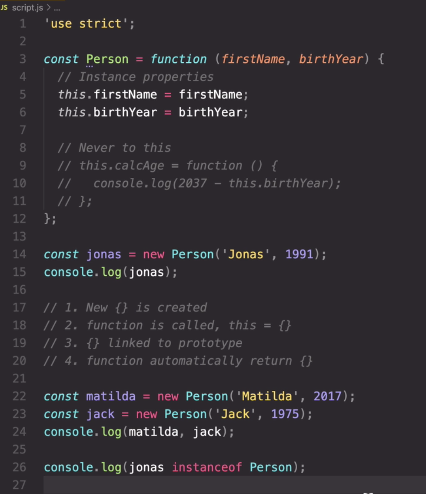
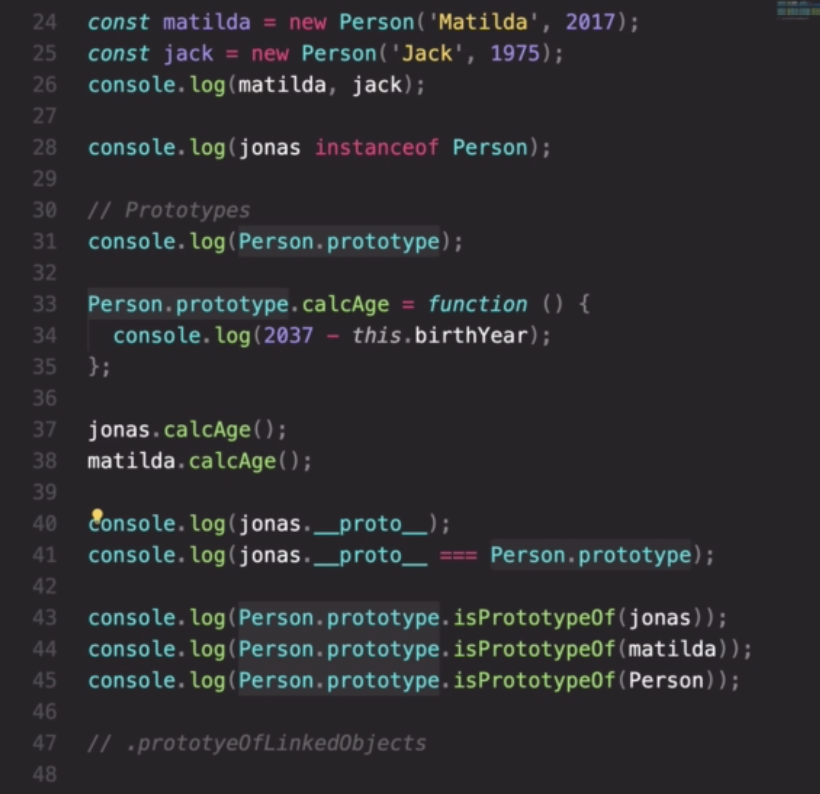
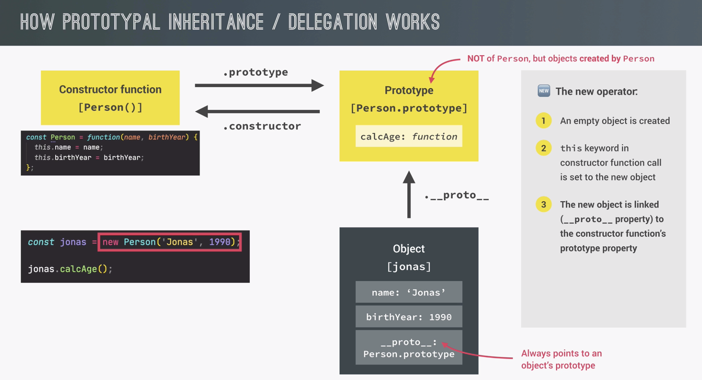
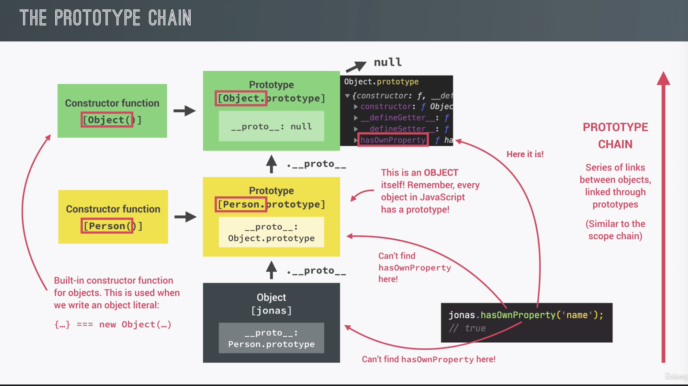

# Udemy JS Complete course (notes & exercises) 2023

### Section 14 - Object Oriented Programming

**Lesson 1: CONSTRUCTOR FUNCTION & NEW OPERATOR**

Constructor functions always start with capital letter.

Function expression and function declarations both work here, arrow functions don't work here (because they don't have "this" keyword).

What happens when we actually call this function with the "new" operator:

1. New object {} is created
2. function is called and in this function call "this" keyword will be set to this newly created object ("this" = new object {} which was created in step 1)
3. the newly created object is linked to a prototype (sets the **proto** property on the object to the prototype property of the constructor function)
4. the object which was created at the beginnig is then automatically returned from the constructor function with the 2 properties we assigned to it (firstName and birthYear).

In classical OOP an object created from a class is called an instance. JS doesn't really have classes in the sense of traditional OOP. However we did create an object from a constructor funtion and constructor functions have been used since the beginning of JS to kind of simulate classes. So we create instances. We can check it with "instanceOf" method.

**Lesson 2: PROTOTYPES**

Each and every function in JS automatically has a property called - prototype. This includes constructor functions. Every object that is created by a certain constructor function will get access to all methods and properties that we define on the constructors prototype property.

We can use the method below on the "jonas" object eventhough it is not really on the object itself - we don't have this method inside our "jonas " object but we have an access to it because of prototypal inheritance.

Having a method (as below - calcAge) outside of the constructor function is much more efficient: as if we had it inside - we would have added a copy of it to every single object that is created. Below we have just one copy of this function, but all of the objects that are created using that object constructor function, can basically reuse thus calAge function on themselves. "this" keyword in each of them is always set to the object that is calling the method.

Any object always has access to the methods and properties from its prototype. In our case - Person is the prototype for jonas object.

Each object has a special property **proto**
In our case - the prototype of jonas object is essentially the prototype property of the constructor function.

"Person.prototype" is NOT the prototype of Person. This is what is going to be used as the prototype of all objects that are created with the Person constructor function.

So it can be called as a prototype of all linked objects.

**Lesson 3: PROTOTYPAL INHERITANCE**

If a property or a method can't be found in object itself, JS will look into its prototype. So we don't have calcAge function in jonas object, but it is available for us to use because JS finds it in the object prototype.

**Lesson 4: PROTOTYPAL INHERITANCE ON BUILDIN OBJECTS**

We can access the prototype property of object: Object.prototype (is the top of prototype chain): here some methods from it that we used before: "hasOwnProperty", "isPrototypeOf" etc).

Array can inherit these methods from its prototype. The prototype property of the constructor is going to be the prototype of all these objects created by that constructor.

The prototype itself is an object.

Functions are a special type of objects in JS. So they also have prototypes.

**Lesson 5: ES6 CLASSES**
